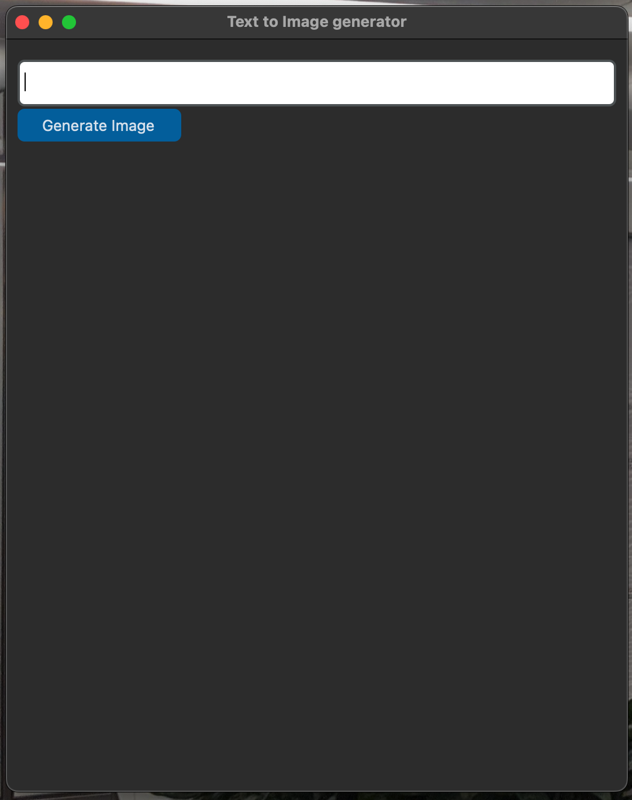

<<<<<<< HEAD
# Text to Image Generator

This project is a simple Text to Image generator built with Python, Tkinter, and PyTorch. It uses a pretrained model from StabilityAI to generate images based on the input text.

## Features

- GUI for easy interaction
- Text input for generating images
- Image output displayed in a scrollable canvas
- Button to trigger image generation

## Installation

To run this project, you need to have Python installed on your machine. You can download Python [here](https://www.python.org/downloads/).

After installing Python, clone this repository to your local machine:

```bash
git clone https://github.com/triobaba/text-to-image-generator.git
```

```bash
cd text-to-image-generator
```

```bash 
pip install -r requirements.txt
```

## Usage
To run the application, execute the following command in the project directory:
```bash
python ./src/app.py
```


## App interface 




A window will open with a text input field and a "Generate Image" button. Enter your text in the input field and click the button to generate an image.

# Contributing
Pull requests are welcome. For major changes, please open an issue first to discuss what you would like to change.

##License
MIT


 
 
=======
# AI-text_image_app
 A text to image application built on stable diffusion 
>>>>>>> main
